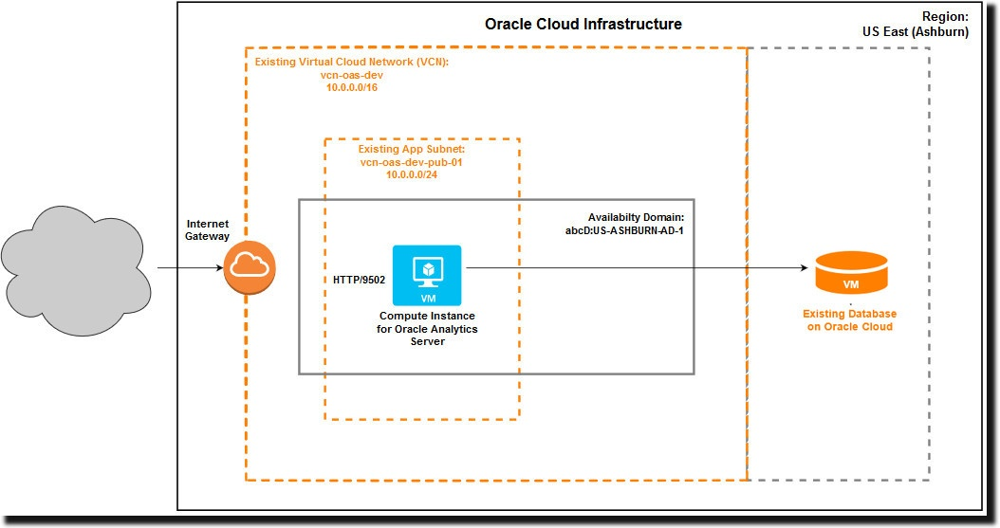

   
   
  <h1>Oracle Analytics Server on Oracle Cloud Infrastructure</h1>
   

<a href="https://docs.oracle.com/en/middleware/bi/analytics-server/index.html">Oracle Analytics Server</a> is a complete modern analytics platform that helps you make smarter predictions and better decisions.  Embedded machine learning and artificial intelligence power intelligent enterprise reporting, ad hoc analysis, and self-service data visualization, so no matter what your role (analyst, engineer, or executive) you can easily analyze data and uncover new insights. 

This Quick Start automates the deployment of Oracle Analytics Server on Oracle Cloud Infrastructure. The Quick Start uses 
<a href="https://docs.oracle.com/en-us/iaas/Content/ResourceManager/Concepts/resourcemanager.htm">Resource Manager</a>, a service on Oracle Cloud Infrastructure that allows you to deploy resources using Terraform.

<h2>Topology</h2>

This topology represents a simple Oracle Analytics Server deployment on Oracle Cloud Infrastructure using this Quick Start.

<h2>Prerequisites</h2>

Before you deploy Oracle Analytics Server on Oracle Cloud, you must complete various prerequisite tasks. Oracle recommends that you gather a list of the metadata that you'll need for the quick-deployment process and we provide a checklist to help you plan your deployment. See <a href="https://docs.oracle.com/en/middleware/bi/analytics-server/deploy-oas-cloud/deploy-oracle-analytics-server-oracle-cloud.html#GUID-054F8080-A6CB-46D2-9166-03D3D21DC8A7">Before you Begin</a>.

<h3>Subscribe to Oracle Analytics Server on Oracle Cloud</h3>

You must have an active Oracle Cloud account (Pay As You Go or Annual Universal Credits) to deploy <i>Oracle Analytics Server - UCM</i> (Universal Credits) on Oracle Cloud Infrastructure. Alternatively, you must have an Oracle Fusion Middleware on-premises license for Oracle Analytics Server and sign up for an Oracle Cloud account to deploy <i>Oracle Analytics Server - BYOL<i> (Bring Your Own License). See <a href="https://docs.oracle.com/en/middleware/bi/analytics-server/deploy-oas-cloud/deploy-oracle-analytics-server-oracle-cloud.html#GUID-821E02BC-169D-41EE-9256-A296E9EC73EE">Subscribe to Oracle Analytics Server on Oracle Cloud</a>.

<h3>Set Up Policies in Oracle Cloud Infrastructure</h3>

In Oracle Cloud Infrastructure, you use policies to control access to resources in your tenancy. Before deploying Oracle Analytics Server on a compartment in Oracle Cloud Infrastructure, your tenant administrator must set up policies that enables you (or other users) to access or create resources in specific compartments. See <a href="https://docs.oracle.com/en/middleware/bi/analytics-server/deploy-oas-cloud/deploy-oracle-analytics-server-oracle-cloud.html#GUID-92B99C32-314E-4565-AD1B-C19CA68AB52C">Set Up Policies in Oracle Cloud Infrastructure</a>.

<h3>Create Compartments</h3>

Before you deploy Oracle Analytics Server on Oracle Cloud, Oracle recommends that you set up the compartment where you want all the resources associated with Oracle Analytics Server to belong. See <a href="https://docs.oracle.com/en/middleware/bi/analytics-server/deploy-oas-cloud/deploy-oracle-analytics-server-oracle-cloud.html#GUID-16204AC6-9155-4762-8E01-E940CCB5BC10">Create Compartments</a>.

<h3>Set Up Network Resources</h3>

You or your network administrator must set up a virtual cloud network (VCN) and a subnet for your Oracle Analytics Server compute instance before you start. See <a href="https://docs.oracle.com/en/middleware/bi/analytics-server/deploy-oas-cloud/deploy-oracle-analytics-server-oracle-cloud.html#GUID-7C30CE28-CBB4-429F-B39E-270A777008C8">Set Up Network Resources</a>.

<h3>Set Up Oracle Cloud Database</h3>

When you deploy Oracle Analytics Server on Oracle Cloud using this Quick Start, you're asked to provide the database connection string and database administrator credentials for an existing database you want to use. See <a href="https://docs.oracle.com/en/middleware/bi/analytics-server/deploy-oas-cloud/deploy-oracle-analytics-server-oracle-cloud.html#GUID-C8C5D819-5EB5-4EE2-98EF-F6093E850B0E">Set Up an Oracle Cloud Database</a>.

<h3>Plan Compute Shape and Boot Volume Size</h3>

You can deploy Oracle Analytics Server on a range of compute shapes to suit different scenarios. If you're not sure which sizes to use, contact your sales team to discuss sizing guidelines.  See also <a href="https://docs.oracle.com/en/middleware/bi/analytics-server/deploy-oas-cloud/deploy-oracle-analytics-server-oracle-cloud.html#GUID-CCFE432C-C6E4-4FB1-A73C-8155CB32A069">Plan Compute Shape and Boot Volume Size</a>.

<h3>Generate SSH Keys</h3>

You must generate the SSH public key and corresponding private key you want to use to access the Oracle Analytics Server compute instance before you start. See <a href="https://docs.oracle.com/en/middleware/bi/analytics-server/deploy-oas-cloud/deploy-oracle-analytics-server-oracle-cloud.html#GUID-4F4ED109-8D4F-4A2A-80B4-28E660013AE8">Generate SSH Keys</a>.

<h3>Complete Predeployment Checklist</h3>

Use a checklist to plan your deployment and ensure you've completed all the prerequisite tasks. See <a href="https://docs.oracle.com/en/middleware/bi/analytics-server/deploy-oas-cloud/deploy-oracle-analytics-server-oracle-cloud.html#GUID-F34E9A58-B40B-4FC1-9279-BB13A13BF972">Complete Checklist</a>.

<h2>Deploy Oracle Analytics Server using Resource Manager</h2>

Download the Quick Start Terraform scripts from GitHub and then use Resource Manager to deploy Oracle Analytics Server on Oracle Cloud Infrastructure. 

<ol>
<li> Complete all the prerequisites tasks and record the information you need in the checklist provided. </li>
<li> On the Oracle Analytics Server quick-start page, click the <b>Code</b> button, select <b>Download ZIP</b>, and save the ZIP file to your local file system (<b>oci-oracle-analytics-server-master.zip</b>). </li>

<li>Extract all the files in <b>oci-oracle-analytics-server-master.zip</b> to a folder on your local file system.</li>
<li>Make sure <b>build.sh</b> is executable (if build.sh isn't executable, run <code>chmod 755 build.sh</code>), and then run <code>build.sh</code> to generate two zip files (one for the BYOL license and other for the UCM license) in the build folder.</li>
<li> Sign into Oracle Cloud Infrastructure Console and navigate to <b>Developer Service</b>s. Under <b>Resource Manager</b>, click <b>Stacks</b>. </li>
<li> Select the compartment in which you want to deploy and run the stack. For example,  <i>MyStacks</i>. </li>
<li> Click <b>Create Stack</b>. </li>
<li> Enter details about your stack and click Next.
  <ul>
      <li> Keep the default <b>My Configuration</b>.</li>
      <li> For Terraform configuration source, select <b>.Zip file</b> and browse to the ZIP file that you created in Step 4. 
The Stack Information section updates to show <b>Oracle Analytics Server - UCM</b> or <b>Oracle Analytics Server - BYOL</b>.</li>
      <li> For Working Directory, select <b>Use Terraform configuration files in the root folder</b>.</li>
      <li> Enter a name for your Oracle Analytics Server stack. For example, <i>My-OAS-Terraform-Stack</i>.</li>
      <li> Add your own description or leave the default. For example, <i>Stack to install Oracle Analytics Server on My TEST compute instance</i>.</li>
</ul>
<li>Set values for the compute instance and network on which Oracle Analytics Server will be deployed, and configure domain information for Oracle Analytics Server.

<b>Compute Instance Configuration</b>

<table>
  <tr>
    <th>Property</th>
    <th>Description</th> 
  </tr>
  <tr>
    <td>Display Name</td>
    <td>Name for the compute instance. For example, <i>MyTestOAS</i>. </td> 
  </tr>
  <tr>
    <td>Target Compartment</td>
    <td>Compartment in which to deploy the Oracle Analytics Server compute instance that this stack generates. For example, <i>MyOracle_Analytics_Server</i>.</td> 
  </tr>
<tr>
    <td>Availability Domain</td>
    <td>Domain in which to create the compute instance. Required only if your tenancy has more than one availability domain.</td> 
  </tr>
  <tr>
    <td>Shape </td>
    <td>Shape for the compute instance. If you select a flexible shape, you can specify the number of OCPUs and the amount of Memory (GB) that you want for the compute instance. </td> 
  </tr>
<tr>
    <td> OCPU</td>
    <td> Only for flexible shapes. Value between 1 and 64. The default is 1 OCPU.</td> 
  </tr>
 <tr>
    <td> Memory</td>
    <td> Only for flexible shapes. Value between 1 and 1024 GB. The default is 15 GB.</td> 
  </tr>
<tr>
    <td>Boot Volume Size</td>
    <td>Size of the boot volume in GB. The minimum volume is 1024 GB and the maximum value is 32768 GB.</td> 
  </tr>
  <tr>
    <td> SSH Public Key</td>
    <td>Public SSH key that you created to access the compute instance.</td> 
  </tr>
</table> 

<b>Network Configuration</b>

<table>
  <tr>
    <th>Property</th>
    <th>Description</th> 
  </tr>
  <tr>
    <td>Compartment</td>
    <td>Compartment containing the Virtual Cloud Network (VCN) you want to use. For example, <i>MyNetwork</i>.</td> 
  </tr>
<tr>
    <td>Virtual Cloud Network</td>
    <td>Virtual cloud network (VCN) where you want to create the compute instance.</td> 
  </tr>
  <tr>
    <td>Subnet</td>
    <td>Subnet for the compute instance.</td> 
  </tr>
  <tr>
    <td>Assign a Public IP Address</td>
    <td>Generates a public IP address for the compute instance.</td> 
  </tr>
</table>

<b>Domain Configuration</b>

<table>
  <tr>
    <th>Property</th>
    <th>Description</th> 
  </tr>
  <tr>
    <td>Create Oracle Analytics Server Domain</td>
    <td>Select to configure a domain for the Oracle Analytics Server compute instance.
        
Don't select <i>Create Oracle Analytics Server Domain</i>, if you want to create an additional Oracle Analytics Server
compute instance to scale out an existing Oracle Analytics Server deployment.
</td> 
  </tr><tr>
    <td>Analytics Administrator Username</td>
    <td>Name of the user who will administer Oracle Analytics Server.
        
Because this is a new user, you can enter any suitable username. For example, <i>myoasadmin</i>.
</td> 
  </tr>
  <tr>
    <td>Analytics Administrator Password</td>
    <td>Password for the Oracle Analytics Server administrator. Enter any suitable password. </td> 
  </tr>
<tr>
    <td>Database Connection String</td>
    <td>Connection string for the database you want to use to store Oracle Analytics Server product schemas.The database must be a pluggable database type (PDB).

Use the format: <i>hostname_or_IP address:port:PDB_name.DB_domain</i>
 

For example: 
 <code>oasdb.sub12345678901.oasvcn.oraclevcn.com:1512:OASDB1213_pdb1.sub12345678901.oasvcn.oraclevcn.com</code>
</td> 
  </tr>
  <tr>
    <td>Database Administrator Username</td>
    <td>Name of an existing user with database administration privileges. For example, <i>myoasdba</i>.</td> 
  </tr>
<tr>
    <td>Database Administrator Password</td>
    <td>Password of the user with database administration privileges. Enter any suitable password.</td> 
  </tr>
  <tr>
    <td>Database Schema Prefix</td>
    <td>Prefix added to the name of each database schema created for Oracle Analytics Server. 
     
For example, <i>MyOAS</i>.
</td> 
  </tr>
<tr>
    <td>Database Schema Password</td>
    <td>Password to access the database schemas used by Oracle Analytics Server. Because this is a new password, you can enter any suitable value.</td> 
 </tr>
</table>
</li>
<li>Click <b>Next</b>, and review the configuration.</li>
<li>Select <b>Run Apply</b>, and click <b>Create</b>.
  
 Monitor progress on the Job Details page. When the stack job finishes, the state changes from <b>In Progress</b> to <b>Succeeded</b>. After the stack job finishes, it takes another 40 minutes to deploy Oracle Analytics Server. 
</li>
<li>To track the deployment process, use SSH to access the compute instance and monitor the deployment logs in the <code>/tmp</code> directory  (<code>oas_install.log</code> and <code>create_domain.log</code>). When Oracle Analytics Server is ready to use, you see the file <code>/tmp/oas_install.finish</code>.</li>
</ol>

<h2>Deploy Oracle Analytics Server Using Terraform</h2>

Download the Quick Start Terraform scripts from GitHub, modify two configuration files (<code>provider.tf</code> and <code>variable.tf</code>), and then run the <code>terraform</code> <code>init,</code> <code>plan</code> and <code>apply</code> commands to deploy Oracle Analytics Server on Oracle Cloud Infrastructure.

<ol>
<li>Complete all the prerequisites tasks and record the information you need in the checklist provided.</li>
<li>Install Terraform version 0.12.x. For example, you can run the following command on Mac with Homebrew:
   
<code>brew install terraform@0.12</code>
</li>
<li>Sign into Oracle Cloud Infrastructure Console and collect your user, tenancy, and signing key details. See <a href="https://docs.oracle.com/en-us/iaas/Content/Identity/Tasks/managingcredentials.htm#To_get_a_config_file_snippet_API_signing_key" rel="nofollow">How to get the config file snippet for an API signing key</a>.</li>
<li>Obtain the code from GitHub either by cloning the repository or by performing the following steps:
<ol>
<li>On the Oracle Analytics Server quick-start page, click the <b>Code</b> button, select <b>Download ZIP</b>, and save the ZIP file to your local file system (<b>oci-oracle-analytics-server-master.zip</b>).</li>
<li>Extract all the files in <b>oci-oracle-analytics-server-master.zip</b> to a folder on your local file system.</li>
</ol>
</li>
<li>Open the file <code>provider.tf</code> for editing, and enter the user and tenancy information you gathered from Oracle Cloud Infrastructure Console in this format:
  
<code>provider "oci" {</code>

  
<code>region = "us-ashburn-1"</code>

  
<code>tenancy_ocid = "ocid1.tenancy.oc1..unique_ID"</code>

  
<code>fingerprint = "12:34:56:78:90:ab:cd:ef:12:34:56:78:90:ab:cd:ef"</code>

  
<code>user_ocid = "ocid1.user.oc1..unique_ID"</code>

  
<code>private_key_path = "~/.oci/oci_api_key.pem"</code>

  
<code>disable_auto_retries = "true"</code>

<code>}</code>

For <code>private_key_path</code>, provide the location of the PEM file you uploaded to the Oracle Cloud Infrastructure Console for API signing keys. See <a href="https://docs.oracle.com/en-us/iaas/Content/API/Concepts/apisigningkey.htm#two" rel="nofollow">How to Generate an API Signing Key</a>.
</li>
<li>In the same folder as <code>provider.tf</code>, open the file <code>variable.tf</code> for editing. Enter the information required to create the compute instance, and optionally, configure the domain for Oracle Analytics Server.

<b>Note:</b> Don't edit the following variables.

<ul><li><code>mp_OAS_listing_id=</code></li>
<li><code>mp_OAS_listing_resource_version=</code></li>
<li><code>mp_OAS_listing_image_resource_id=</code></li>
</ul></li>
<li>The default setting is for the BYOL license. To use the UCM license, copy the content of the following three UCM config files (file names ending with .ucm) to the corresponding BYOL config files. For example, copy the content of the <code>oci_images.tf.ucm</code> file to the <code>oci_images.tf</code> file.
<table>
  <tr>
    <th>BYOL Config Files</th>
    <th>UCM Config Files</th> 
  </tr>
  <tr>
    <td><code>oci_images.tf</code></td>
    <td><code>oci_images.tf.ucm</code></td> 
  </tr>
<tr>
    <td><code>schema.yaml</code></td>
    <td><code>schema.yaml.ucm</code></td> 
  </tr>
  <tr>
    <td><code>terraform.tfvars</code></td>
    <td><code>terraform.tfvars.ucm</code></td> 
  </tr>  
</table>
</li>
<li>After saving both configuration files, run the following commands to deploy Oracle Analytics Server on Oracle Cloud Infrastructure:
 <ul>
  <li><code>terraform init</code></li>
  <li><code>terraform plan</code></li>
  <li><code>terraform apply</code></li>
 </ul></li>
</ol>

<h2>Post-Deployment Tasks</h2>

Refer to the documentation for a list of post-deployment tasks. See <a href="https://docs.us.oracle.com/en/middleware/bi/analytics-server/deploy-oas-cloud/deploy-oracle-analytics-server-oracle-cloud.html#GUID-4DA72FBE-C456-49B7-8424-56DE890CD886">Complete Post Deployment Tasks</a>. 

<h2>Using OCI Resource Manager</h2>

Oracle Cloud Infrastructure Resource Manager (ORM) allows you to manage your Terraform configurations and state. You might need to update your policies to access the ORM service. 

<code>allow group mygroup_name to read compartments in tenancy</code>

<code>allow group mygroup_name to manage instance-family in compartment mycompartment_name</code>

<code>allow group mygroup_name to use virtual-network-family in compartment mycompartment_name</code>

<code>allow group mygroup_name to manage orm-family in compartment mycompartment_name</code>

<h2>License</h2>

These Terraform scripts are licensed under the Universal Permissive License 1.0. See <a href="https://github.com/oracle-quickstart/oci-oracle-analytics-server/blob/master/LICENSE">LICENSE</a> for more details.

There are two licensing options available:

<h3>Universal Credits Model (UCM)</h3>

When you deploy Oracle Analytics Server using UCM, the Oracle Analytics Server license is governed by the following Licensing terms: https://cloudmarketplace.oracle.com/marketplace/content?contentId=70514770&render=inline

<h3>Bring Your Own License (BYOL)</h3>

When you deploy Oracle Analytics Server using BYOL, the Oracle Analytics Server license is governed by the following Licensing terms: https://cloudmarketplace.oracle.com/marketplace/content?contentId=18088784&render=inline

BYOL requires an Oracle Fusion Middleware on-premise license for Oracle Analytics Server, and an active support contract.

<h2>Questions</h2>

If you have an issue or a question, review our <a href="https://docs.oracle.com/en/middleware/bi/analytics-server/deploy-oas-cloud/frequently-asked-questions.html">FAQs</a> page. 
